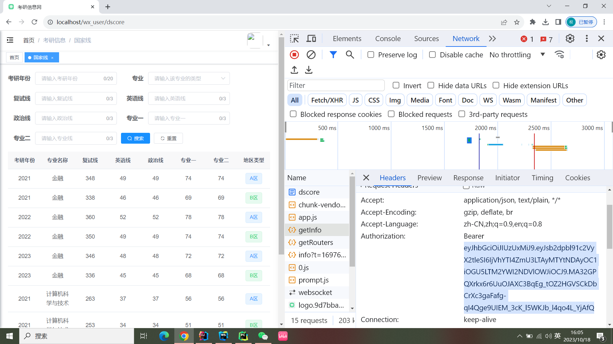

# 数据
school major dScore这三运行都是要访问后端的，需要提供token，且开启后端服务器

token要从浏览器那里获取，刷新就行了，具体看下图。在浏览器中按下F12在上面那一栏中点击Network，刷新一下找到这个getInfo肯定是会有token的数据的，下拉找到Authorization字段，只需要复制图中选中的文字即可。复制后的文本粘贴到`./resources/Authorization.txt`即可，注意是覆盖的复制

